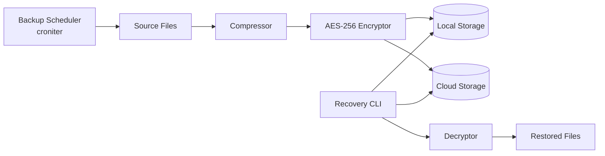
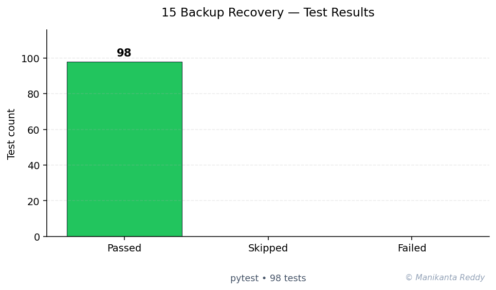

# Automated Backup & Recovery System

<p align="center">
  
  
  
  
  
  
</p>

a, production-grade Python-based automated backup and recovery system. Features multiple backup targets (local filesystem, AWS S3, Google Cloud Storage, Azure Blob), cron-like scheduling, compression, AES-256 encryption, integrity verification, retention policies, and multi-channel notifications.

## Features

- **Multiple Backup Sources**
  - File system (recursive, with glob exclusions)
  - PostgreSQL, MySQL/MariaDB, SQLite databases
  - Cloud resources (S3, GCS, Azure, SFTP)

- **Multiple Storage Backends**
  - Local filesystem
  - AWS S3 (with presigned URLs)
  - Google Cloud Storage
  - Azure Blob Storage

- **Cron-like Scheduling**
  - Standard cron expression support
  - Configurable polling interval
  - Runtime job management (add/remove)
  - Graceful shutdown handling

- **Compression Support**
  - Gzip, Bzip2, Zip formats
  - Configurable compression levels
  - Auto-detection by extension and magic number

- **Encryption (AES-256)**
  - Fernet authenticated encryption (AES-128-CBC + HMAC)
  - PBKDF2 key derivation (600K iterations, SHA-256)
  - Random salt per encryption
  - Password hashing utilities

- **Retention Policies**
  - Grandfather-father-son rotation
  - Daily, weekly, monthly classification
  - Configurable retention periods
  - Automatic cleanup

- **Integrity Verification**
  - SHA-256, SHA-512, MD5 checksums
  - Tar and Zip structural checks
  - Checksum file generation

- **Restore Operations**
  - Multi-stage restore pipeline
  - Cloud-to-local download
  - Automatic format detection
  - Path traversal protection

- **Notifications**
  - Webhook (HTTP POST with JSON)
  - Email (SMTP)
  - Configurable per event type

## Screenshots

> *The CLI interface showing backup job listing and execution status*

```
$ backup-recovery --config config.yaml list-jobs

Job Name             Type         Schedule             Status     Source
------------------------------------------------------------------------------------------
documents            file         0 2 * * *            ENABLED    ./documents
postgres_main        database     0 3 * * *            ENABLED    mydb
mysql_app            database     0 4 * * *            ENABLED    appdb
s3_metadata          cloud        0 5 * * 0            ENABLED    s3://my-bucket

Total: 4 jobs

$ backup-recovery --config config.yaml backup --job documents
2024-01-15 02:00:00 [INFO] Running backup job: documents (type=file)
2024-01-15 02:00:01 [INFO] Archive created: /tmp/backup_xxx/documents_20240115_020000.tar.gz
2024-01-15 02:00:01 [INFO] File encrypted: documents_20240115_020000.tar.gz.enc
2024-01-15 02:00:02 [INFO] Backup stored locally: ./backups/documents/documents_20240115_020000.tar.gz.enc
2024-01-15 02:00:02 [INFO] File backup 'documents' completed successfully
```

## Quick Start

### Installation

```bash
# Clone the repository
git clone https://github.com/example/backup-recovery.git
cd backup-recovery

# Create virtual environment
python -m venv venv
source venv/bin/activate  # On Windows: venv\Scripts\activate

# Install core dependencies
pip install -r requirements.txt

# Install with specific cloud backends
pip install -e ".[s3,gcs]"

# Install everything
pip install -e ".[all,dev]"
```

### Configuration

1. Generate a default configuration file:

```bash
python -m src.cli init --output config.yaml
```

2. Edit `config.yaml` to define your backup jobs (see [configs/example_config.yaml](configs/example_config.yaml) for a full example).

3. Validate the configuration:

```bash
python -m src.cli --config config.yaml validate
```

### Running Backups

```bash
# Run a specific backup job
python -m src.cli --config config.yaml backup --job documents

# Run all enabled jobs
python -m src.cli --config config.yaml backup

# Dry run (show what would be done)
python -m src.cli --config config.yaml backup --dry-run
```

### Scheduling

```bash
# Start the scheduler daemon
python -m src.cli --config config.yaml schedule

# With custom polling interval
python -m src.cli --config config.yaml schedule --interval 300
```

### Restoring

```bash
# Restore from a local archive
python -m src.cli --config config.yaml restore --archive ./backups/documents_20240115.tar.gz

# Restore to a specific destination
python -m src.cli --config config.yaml restore --archive ./backups/documents_20240115.tar.gz --destination /tmp/restored

# Restore encrypted archive
python -m src.cli --config config.yaml restore --archive ./backups/documents_20240115.tar.gz.enc --encryption-key "my-secret"
```

### Listing Jobs

```bash
python -m src.cli --config config.yaml list-jobs
```

## Architecture

See [docs/architecture.md](docs/architecture.md) for a detailed architecture overview, including:

- System design and component diagram
- Data flow for backup, restore, and scheduled execution
- Security considerations
- Extensibility guide

```
src/
├── cli.py              # Command-line interface
├── config.py           # Configuration management
├── scheduler.py        # Cron-based job scheduler
├── compression.py      # Gzip/Zip/Bzip2 compression
├── encryption.py       # AES-256 encryption
├── integrity.py        # Checksum verification
├── retention.py        # Retention policy management
├── restore.py          # Restore operations
├── notifications.py    # Webhook/Email notifications
├── backup/
│   ├── file_backup.py      # File system backup
│   ├── database_backup.py  # Database backup
│   └── cloud_backup.py     # Cloud resource backup
└── storage/
    ├── local.py        # Local filesystem storage
    ├── s3.py           # AWS S3 storage
    ├── gcs.py          # Google Cloud Storage
    └── azure.py        # Azure Blob Storage
```

## Tech Stack

| Component | Technology |
|-----------|------------|
| Language | Python 3.9+ |
| Scheduling | croniter |
| Encryption | cryptography (Fernet/AES-128) |
| YAML Parsing | PyYAML |
| Cloud: AWS S3 | boto3 |
| Cloud: GCS | google-cloud-storage |
| Cloud: Azure | azure-storage-blob |
| SFTP | paramiko |
| Webhooks | requests |
| Testing | pytest, pytest-cov |
| Linting | black, flake8, mypy, isort |

## Running Tests

```bash
# Run all tests
pytest

# Run with coverage
pytest --cov=src --cov-report=html

# Run specific test file
pytest tests/test_compression.py -v

# Run with verbose output
pytest -v --tb=long
```

## Configuration Reference

### Cron Expressions

The scheduler uses standard 5-field cron expressions:

| Field | Values |
|-------|--------|
| Minute | 0-59 |
| Hour | 0-23 |
| Day of Month | 1-31 |
| Month | 1-12 |
| Day of Week | 0-7 (0 and 7 = Sunday) |

Examples:
- `0 2 * * *` - Daily at 2:00 AM
- `0 */6 * * *` - Every 6 hours
- `0 3 * * 0` - Weekly on Sunday at 3:00 AM
- `0 0 1 * *` - Monthly on the 1st

### Storage Backends

| Backend | Required Config |
|---------|----------------|
| local | `path` |
| s3 | `bucket`, `region`, `access_key`, `secret_key` |
| gcs | `bucket`, (optional: `project_id`) |
| azure | `bucket` (container), `connection_string` |

### Retention Policy

| Period | Default | Description |
|--------|---------|-------------|
| Daily | 7 days | Regular daily backups |
| Weekly | 4 weeks | Monday backups |
| Monthly | 12 months | 1st-of-month backups |

## Future Improvements

- [ ] Incremental backup support (rsync-style)
- [ ] Deduplication (block-level or file-level)
- [ ] GUI dashboard (web-based or desktop)
- [ ] Distributed backup coordination
- [ ] Backup chain/dependency management
- [ ] Prometheus metrics export
- [ ] REST API for remote management
- [ ] Plugin system for custom backup providers
- [ ] Multi-threaded cloud uploads
- [ ] Backup verification jobs (periodic restore tests)

## License

This project is licensed under the MIT License - see [LICENSE](LICENSE) for details.

## Contributing

Contributions are welcome! Please feel free to submit a Pull Request. For major changes, please open an issue first to discuss what you would like to change.

## Acknowledgments

- The `croniter` library for reliable cron expression evaluation
- The `cryptography` library for secure encryption primitives
- Python's `tarfile` and `zipfile` modules for archive handling

---

<!-- showcase:start -->

## Architecture



## Test Results



**98 passing**, **0 failing**, **0 skipped** (total 98, framework: pytest)

## References & Further Reading

- NIST FIPS 197 (2001). *Advanced Encryption Standard (AES).* [↗](https://nvlpubs.nist.gov/nistpubs/FIPS/NIST.FIPS.197.pdf)
- 3-2-1 Backup Strategy — US-CERT guidance. None [↗](https://www.cisa.gov/news-events/news/data-backup-options)

## Author

**Manikanta Reddy Mandadhi** — Senior Data Scientist (RAG / Agentic AI)

GitHub: [@Mani9006](https://github.com/Mani9006/backup-recovery-system) · LinkedIn: [reddy1999](https://www.linkedin.com/in/reddy1999) · Portfolio: [manikantabio.com](https://www.manikantabio.com)

<!-- showcase:end -->
